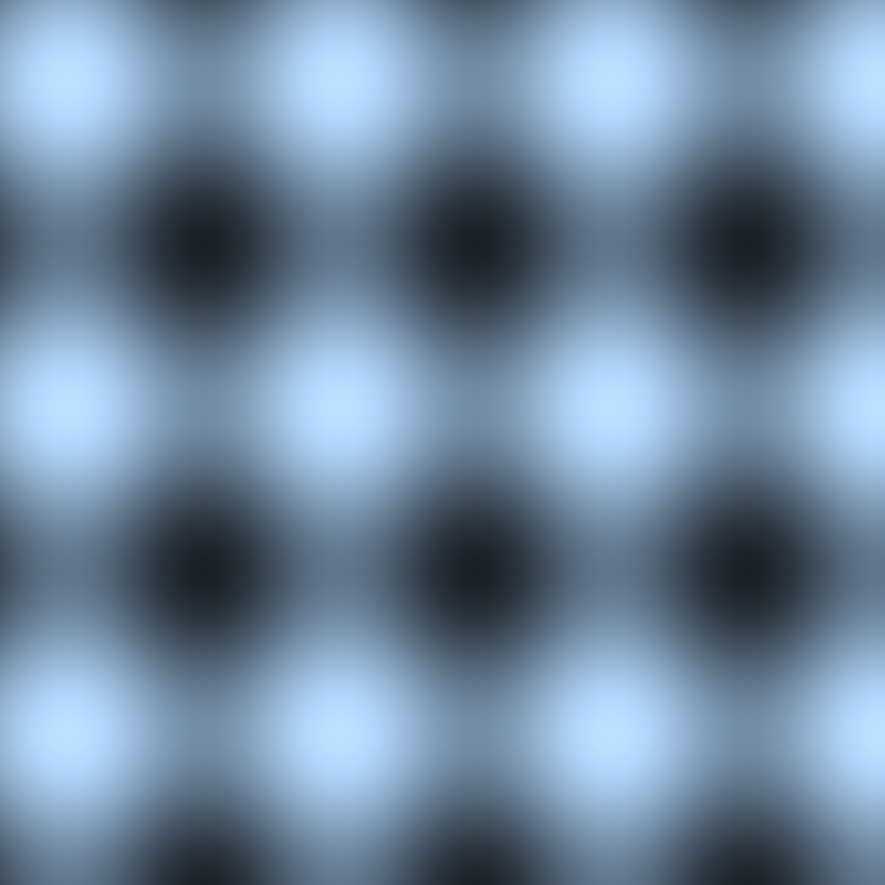
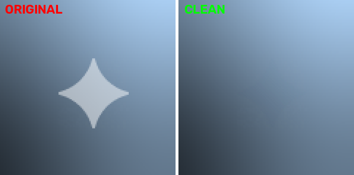
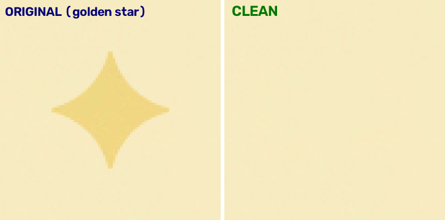

<p align="center">
  
</p>

<h1 align="center">Gemini Watermark Remover Pro</h1>

<p align="center">
  <b>Google Gemini / Veo 图片 & 视频 一键无痕去水印</b><br/>
  纯代数反向 Alpha 混合逆解，无损还原底层纹理，零模糊、零涂抹
</p>

<p align="center">
  
  
  
  
</p>

<p align="center">
  <a href="#演示效果">演示效果</a> ·
  <a href="#核心原理">核心原理</a> ·
  <a href="#快速上手">快速上手</a> ·
  <a href="#使用教程">使用教程</a> ·
  <a href="#命令行参数">命令行参数</a>
</p>

---

## ✨ 简介

使用 Google Gemini / Veo 生成图片或视频时，右下角总会被加上一个半透明的 **四角星品牌水印**。常规工具（剪映、Photoshop 涂抹、AI 重绘）要么破坏画质，要么产生毛玻璃糊斑。

本项目用**数学精确还原**的方式替代"盲目修补"——通过反向 Alpha 混合逐像素把水印下方的真实纹理"提"回来，做到 **100% 保留底层细节、零模糊**。

- ✅ 同时支持 **图片**（PNG/JPG/WEBP/…）和 **视频**（MP4）
- ✅ 单像素纯代数逆解，**无 Inpaint 漫水**，杜绝糊斑
- ✅ 视频可选 **Lanczos4 超分至 1080P** 并保留原音轨
- ✅ **多段拼接视频** 支持 `--auto-calibrate` 逐帧增益校准（各片段水印强度不一致时一键搞定）
- ✅ **零配置**：自动补全 FFmpeg，Windows 拖拽即用
- ✅ 可作 **Trae/Claude Skill** 挂载，交给 AI 自动执行

> 本项目是 [lazyvip/gemini-watermark-remover](https://github.com/lazyvip/gemini-watermark-remover)（纯图片版）的强化超集，新增了视频引擎、自动档位匹配、透明通道保留与跨平台自动封装能力。

---

## 🌐 在线体验（图片 · 免安装）

不想装任何东西？**图片去水印可以直接在网页里上传处理**，浏览器本地完成、无需上传服务器：

👉 **https://ai.lazyso.com/** — 打开即用，支持 Gemini 图片水印、豆包/可灵、手动涂抹等，免费、隐私就地处理。

> 网页版专注图片去水印；**视频/批量**去水印请用本仓库的本地脚本（下一步）。

---

## 🎬 演示效果

### 视频去水印（Veo）

原视频右下角为 Gemini/Veo 的半透明四角星水印，去水印后画面细节（衣物纹理、光斑、颗粒）完全保留，没有任何方块糊斑。

> GitHub 不能在 README 内直接内嵌播放视频。点击下方两个文件名，即可在 GitHub 原生播放器里逐帧对比去水印前后效果：

- ▶ **去水印前（原视频）：** [`gemini_before_preview.mp4`](docs/demo/gemini_before_preview.mp4)
- ▶ **去水印后（1080P 成品）：** [`gemini_after_preview.mp4`](docs/demo/gemini_after_preview.mp4)

### 图片去水印（白色加光型 · 深色背景）

左侧为带水印原图，右侧为去水印后的结果——渐变背景完全连续，无残留星形、色差或模糊边界。



### 图片去水印（金色减光型 · 浅色背景）

Gemini 图片在浅色背景下会使用深/金色不透明水印。工具能**自动识别水印配色**，针对金色星形做背景精确回填，还原完全无痕。



---

## 🚀 一键安装为 Skill（推荐给不会命令行的人）

把本项目装成 Skill 后，就能让 AI 助手（Trae / Claude Code）自动看懂并调用 `remove_watermark.py`，你只需说一句"帮我去掉这个视频/这张图的水印"。

### 方式一：让 AI 帮你安装，装完直接开干

把下面这句连同**仓库地址**一起发给你的 AI 助手，安装和调用可以一步到位：

> 🤖 **"把这个 GitHub 仓库安装为 Skill：https://github.com/lazyvip/gemini-watermark-remover-pro，帮我处理 xxx.mp4（或 xxx.png）的水印"**

AI 会把仓库内容下载到本机的 Skill 目录，随后直接执行去水印任务，无需重启、无需碰命令行。

### 方式二：手动复制（几秒钟，最稳定）

把整个仓库文件夹复制到对应 Skill 目录：

| AI 工具 | 安装路径（复制到该目录） |
|---------|-------------------------------|
| **Trae / Claude Code** (macOS) | `~/.trae-cn/skills/gemini-watermark-remover-pro/` |
| **Trae / Claude Code** (Windows) | `%USERPROFILE%\.trae-cn\skills\gemini-watermark-remover-pro\` |

### 安装后怎么调用

装好后，直接对你的 AI 助手说一句话即可自动去水印，比如：

- *"帮我去掉这个 Gemini 视频的水印"*（也可带上文件路径）
- *"帮我清理这张图右下角的水印"*
- *"批量处理 `文件夹/` 下所有带水印的图片"*（AI 会循环调用）

AI 会自动调用项目里的 `remove_watermark.py` 完成解析、去水印和超分，全程无需你碰命令行。

> 💡 不想装 Skill 的话，也可以直接用 `run_windows.bat`（Windows 把文件拖进去）或 `python remove_watermark.py 文件` 本机处理。

---

## 🔬 核心原理

### 水印是怎么"盖"上去的

Gemini 采用经典的 **Alpha 加权混合（alpha compositing）** 把白色四角星叠加到画面上：

$$I_{\text{watermarked}} = \alpha \cdot 255 + (1 - \alpha) \cdot I_{\text{original}}$$

- $\alpha$ 是每个像素的透明白度（`0.0` 全透明 ～ `1.0` 不透明），来自 Google 官方的 48×48 Alpha Map
- `255` 是白色本次所用的 `LOGO_VALUE`

### 反向"解"出水印下面的原图

既然我们**精确知道**每个像素的 $\alpha$，就可以直接代数求逆：

$$I_{\text{original}} = \frac{I_{\text{watermarked}} - \alpha \cdot 255}{1 - \alpha}$$

这是一个**单像素、点对点**的纯数学运算，完全不需要借用周围像素的颜色（那是 `cv2.inpaint` 干的事）。因此水印下方原本的木纹、衣服褶皱、物体反光和细微噪点都能 100% 原样保留。

### 工程上的三个关键细节

1. **底噪门限截断**：设 `ALPHA_NOISE_FLOOR = 3/255`，对外围透明的微小 Alpha 信号直接归零，避免在边缘形成暗圈。
2. **增益适配 + 水印配色自适应（图片 vs 视频）**：
   - 视频经过 H.264/YUV420 有损压缩、色度有轻微衰减，默认 `gain = 1.0` 完整反向 Alpha 逆解，确保水印彻底消失；若个别片段出现"中心残白"，用 `--gain` 实测微调（如 0.58）即可；
   - 图片（无色彩损耗）：采用**自动配色检测**——扫描右下星形区中心与四角背景的亮度关系：
     - 中心**亮**于背景 → 白色加光型水印（深色背景），用 `gain = 1.0` 无损反向混合；
     - 中心**暗**于背景 → 深/金色减光型水印（浅色背景），改为**背景色精确回填**（覆盖在均匀背景上的不透明标识），同样做到完全无痕。
3. **水印尺寸档位自动匹配**（图片）：依据官方尺寸目录，最大边 ≥1600px 匹配 96px 水印 + 64px 边距，其余匹配 48px + 32px。

> 💡 对比：Inpaint 属于"无中生有"的邻域漫水填补，必然抹平高频纹理；本项目属于"数学提纯"，完全靠该像素自身残留的光子信号还原，因此能做到图片级无痕。

---

## ⚡ 快速上手

### 环境要求

- Python 3.8+
- FFmpeg（**无需手动安装**：脚本会自动从官方源静默补全）

```bash
pip install -r requirements.txt
```

### 图片去水印

```bash
python remove_watermark.py "gemini_image.png"
# → 输出 gemini_image_clean.png
```

### 视频去水印（默认超分至 1080P）

```bash
python remove_watermark.py "gemini_video.mp4"
# → 输出 gemini_video_clean.mp4
```

---

## 📖 使用教程

### Windows 用户（零配置，最推荐）

1. 安装 [Python 3.8+](https://www.python.org/downloads/) 并勾选 **Add Python to PATH**；
2. 把要处理的 **图片或视频文件直接拖拽到 `run_windows.bat` 图标上**；
3. 脚本自动检测文件类型、自动补齐依赖，生成纯净成品。

### 命令行进阶

```bash
# 视频保持原分辨率（不做超分）
python remove_watermark.py "video.mp4" --no-upscale

# 指定输出路径
python remove_watermark.py "img.png" -o out.png

# 手动指定图片水印尺寸/边距（自动档位不适用时）
python remove_watermark.py "img.png" --logo-size 96 --margin 64

# 切换去水印模式（默认 lossless 最佳）
python remove_watermark.py "video.mp4" --mode hybrid

# 多段拼接视频逐帧自动校准（不同片段水印深浅不一、去完仍有残留时使用）
python remove_watermark.py "stitched_video.mp4" --no-upscale --auto-calibrate
```

### 多段拼接视频的「逐帧自动校准」（进阶）

**问题背景**：用 Gemini 分段生成再拼接的视频（或从不同批次下载的片段），各段 H.264 编码损耗不同，导致同一颗星星的实际不透明度**每段都不一样**——统一增益必然顾此失彼：有的段残留白星，有的段出现暗鬼影。更极端的情况：整段视频水印**极淡**（所需增益低至 0.14~0.20）且背景是**亮色天空**，此时传统可靠帧过滤会把全部帧拒收、回退 gain=1.0，把整片水印过度减除成**暗色鬼影**。

**解决原理**（2025-09 三个实战案例沉淀）：

1. 对每个采样帧，在增益网格 `0.02 ~ 1.00`（步长 0.02，50 档）上**模拟**去水印；
2. 测量「星形高 alpha 台地」与「低 alpha 环带」的亮度差 `delta(g)`，用**括号穿越 + 线性插值**解 `delta = +3`（轻微偏亮不可见——宁偏亮，不偏暗成鬼影）；极淡水印自动钳到网格下限，**绝不回退 1.0**；
3. **可靠帧分档**：暗背景帧（`(255-bg).min() > 60`）读数最可信。可靠帧充足时，亮背景帧用可靠帧**线性插值**替换（防高光截断偏差泄漏）；可靠帧不足 5 个时**放开使用全部帧读数做锚点**（极淡水印不触发光高截断，亮背景读数照样精确）；
4. **默认逐帧校准**（`--calibrate-step 1`）：水印强度随时间渐变（如淡入淡出）时逐帧解算才能跟上；未采样帧用相邻锚点线性插值填充；
5. **绝不做跨帧平滑**：拼接缝/转场的相邻帧增益差异极大，平滑会把对的改错。

**实测效果**（480 帧拼接视频）：

| 方案 | 可靠帧 delta 均值 | 高通结构残留帧数 |
|------|------|------|
| 人工调参恒定增益 0.604 | -7.34（轻微暗鬼影） | 16 帧 |
| `--auto-calibrate` 逐帧校准 | **+3.44（正中目标）** | **4 帧** |

**极淡+亮背景案例**（116 帧横屏视频）：修复前 gain=1.0 全片暗鬼影（delta -33~-48）；修复后逐帧校准增益中位 0.163、范围 [0.137, 0.520]，成片最暗 delta 0.00、最亮 2.95、0 帧超阈值。

> 💡 验证残留真伪时注意：亮背景帧反解后 delta 天然偏正（编码高光截断所致，平滑不锐利、肉眼不可见），属**假阳性**。判别真残留请用高通结构残差（`hp = gray - GaussianBlur(gray, 31)`，台地与环带 `mean(|hp|)` 差 > 2.0 才算锐利残留）。

### 作为 Trae / Claude Skill 使用

将本目录整体复制到对应 Skill 目录：

- macOS: `~/.trae-cn/skills/gemini-watermark-remover-pro/`
- Windows: `%USERPROFILE%\.trae-cn\skills\gemini-watermark-remover-pro\`

然后在 Trae 中对话：*"帮我去掉这个 Gemini 图片/视频的水印"*，AI 会自动调度执行。

---

## ⚙️ 命令行参数

| 参数 | 说明 | 默认 |
|------|------|------|
| `input` | 输入文件路径（图片或视频） | 必填 |
| `-o, --output` | 输出文件路径 | 自动生成 `_clean` |
| `--mode` | 去水印模式：`lossless` / `hybrid` / `inpaint` | `lossless` |
| `--gain` | Alpha 增益：默认视频 1.0，图片 1.0；视频可按需下调 | 自动识别 |
| `--no-upscale` | （视频）不做 1080P 超分 | 关闭 |
| `--auto-calibrate` | （视频）逐帧增益自动校准，多段拼接视频各片段水印强度不一致时使用 | 关闭 |
| `--calibrate-step` | （视频）校准采样步长，每 N 帧校准 1 帧，越小越精确越慢 | `2` |
| `--logo-size` | （图片）水印像素尺寸 | 0=自动 |
| `--margin` | （图片）水印距右下角边距 | 0=自动 |

---

## ❓ 常见问题

<details>
<summary>视频是多段拼接的，去完有的片段还有残留/发暗怎么办？</summary>

这是拼接视频的典型问题：各段生成批次不同，水印实际不透明度每段都不一样，统一增益无法兼顾。加 `--auto-calibrate` 逐帧自动校准即可：

```bash
python remove_watermark.py "stitched_video.mp4" --no-upscale --auto-calibrate
```

脚本会自动为每帧求解最佳增益（亮背景帧自动跳过并沿用邻近增益），实测比人工调参更干净。
</details>

<details>
<summary>为什么我的图片去水印后有残留？</summary>

多半是水印尺寸档位与该图片不符。Gemini 的不同生成尺寸使用了 48px 或 96px 的水印，自动匹配基于官方档位。若仍不精确，用 `--logo-size 96 --margin 64` 或 `--logo-size 48 --margin 32` 手动指定。
</details>

<details>
<summary>视频去水印后画质会下降吗？</summary>

不会。画面采用纯代数还原（不二次压缩像素），超分用 Lanczos4 高保真插值，封装用 CRF=18 高质量编码并保留原始 AAC 音轨。全程尽量保持源质量。
</details>

<details>
<summary>运行提示找不到 FFmpeg？</summary>

脚本内置自动下载逻辑，通常会在联网时静默补全。若离线环境失败，可用 `pip install imageio-ffmpeg` 安装一个附带 FFmpeg 的备选方案。
</details>

---

## 📄 许可 & 致谢

- 开源许可：[MIT](./LICENSE)
- Alpha Map 与尺寸档位源自开源技术剖析
- 前端/信息展示参考：[ai.lazyso.com](https://ai.lazyso.com)

如果你觉得这个工具帮到了你，欢迎 ⭐ Star、Fork、Issue，或在评论区分享你的使用体验。

<p align="center">Made with ❤️ for the Gemini creator community</p>